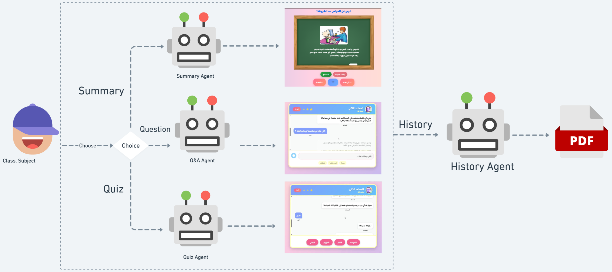

# Etude.AI – AI-powered educational platform that supports children with learning difficulties through personalized content in the Tunisian dialect. 
<p align="center">
  
</p>

Etude.AI is an interactive tutoring environment for Arabic-speaking primary students. It combines an Angular front-end, an AI back-end based on LangChain/CrewAI, and a FastAPI micro-service that adds text-to-speech (TTS). All learning material is stored in a Neo4j knowledge graph created from the official school book.
<p align="center">
  
</p>

---

## Project structure
```

Etude.AI/
├── AI Pipeline/                 # Notebooks + KG and agent code
│   ├── arabic-kg-driven-learning-assistant.ipynb
│   ├── agents-integration-using-fastapi-and-ngrok.ipynb
│   └── kg\_construction.py       # builds the Neo4j knowledge graph
├── frontend/                    # Angular web client
├── TTS-Integration/             # FastAPI micro-service for speech

````

---

## Quick start

### Front-end
```bash
cd frontend
npm install
ng serve
````

Navigate to `http://localhost:4200`.

### TTS service

```bash
cd TTS-Integration
python -m uvicorn main:app --reload
```

Starts the `/tts` endpoint used by the chatbot for audio output.

### AI back-end

Open **AI Pipeline/agents-integration-using-fastapi-and-ngrok.ipynb** and run the notebook.

* The notebook launches the CrewAI agents (Router, Summary, Q\&A, Quiz, Feedback).
* It exposes them through a FastAPI server, then tunnels the port with **ngrok**.
* Copy the public ngrok URL and paste it into:

  ```ts
  // frontend/src/environments/environment.ts
  export const environment = {
    apiUrl: "https://YOUR_NGROK_ID.ngrok.io"
  };
  ```

---

## What the AI Pipeline code does

| File / Notebook                                      | Purpose                                                                                                                                                                                             |
| ---------------------------------------------------- | --------------------------------------------------------------------------------------------------------------------------------------------------------------------------------------------------- |
| **kg\_construction.py**                              | Converts a nested Python dictionary of curriculum data into Neo4j nodes: `(Branch)–[:HAS_TOPIC]→(Topic)–[:HAS_LESSON]→(Lesson)`. It can optionally clear the database first and then repopulate it. |
| **arabic-kg-driven-learning-assistant.ipynb**        | End-to-end demo: Arabic OCR of the scanned textbook, semantic chunking, vector store creation with Chroma, and retrieval tests.                                                                     |
| **agents-integration-using-fastapi-and-ngrok.ipynb** | Starts the Gemini-powered CrewAI agents, defines retrieval tools, exposes a FastAPI route (`/chat`), and launches ngrok for external access.                                                        |
| **TTS-Integration/main.py**                          | Minimal FastAPI app with one route that accepts text and returns synthesized speech (WAV / MP3).                                                                                                    |

---

## AI workflow (high-level)


1. The student selects **Summary**, **Question**, or **Quiz**.
2. The Router agent classifies the request.
3. Depending on the branch, the system retrieves the relevant lessons and images from Neo4j, then hands control to the Summary, Q\&A, or Quiz agent.
4. All turns are stored in session memory. When the student ends the session the Feedback agent compiles a PDF report via ReportLab.

---

## Demo video

<video src="https://your-demo-video-link.mp4" width="700" controls></video>

If your platform does not render the inline video, you can watch it directly:
[Link](https://drive.google.com/file/d/1NpsDk9j0XDxI0VBrm39RrBFyQ2e-RVHF/view?usp=sharing)

---

## Technology stack

* Angular 17, TypeScript
* FastAPI + ngrok
* CrewAI, LangChain, Chroma, Gemini API
* HuggingFace AraBERT embeddings and reranker
* Neo4j AuraDB
* Tesseract OCR + PyMuPDF (Arabic)
* ReportLab for PDF generation

---

## Notes

* To update textbook content or the KG structure, rerun `kg_construction.py`.
* Keep the ngrok tunnel active while the Angular app is running; otherwise the API calls will fail.
* Recommended versions: **Node ≥ 18** and **Python ≥ 3.10**.


